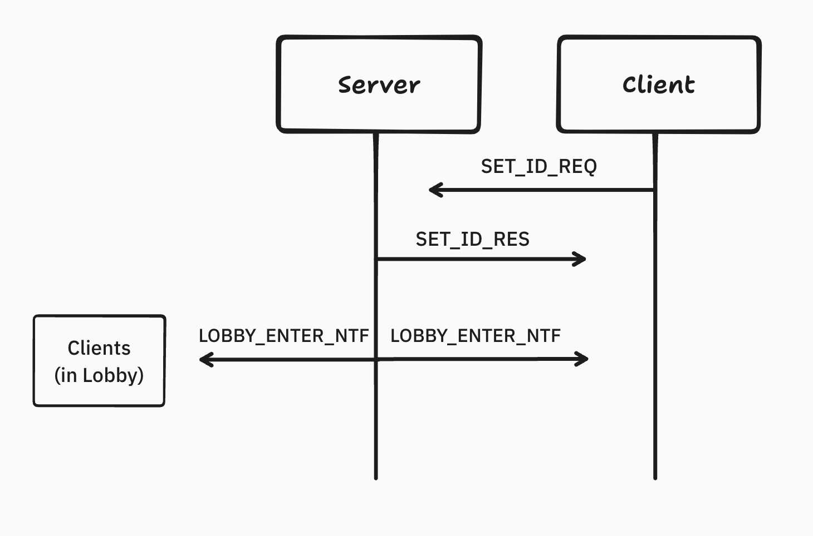

## 오류 발생 과정



Server ↔ Client 간의 소켓 통신 과정은 아래와 같습니다.

1. Client: `SET_ID_REQ` 를 통해 ID 설정
2. Server:  해당 Client의 ID를 설정하고
   1. “set $ID Success”를 해당 Client에게 전송 (`SET_ID_RES`)
   2. “$ID 님이 입장하셨습니다”를 모든 Client에게 전송  (`LOBBY_ENTER_NTF`)
3. Client: `boost::async_read()` 를 통해 수신

이 과정에서 아래 에러가 발생했습니다.  
libc++abi: terminating due to uncaught exception of type std::__1::system_error: mutex lock failed: Invalid argument  
**(해당 오류는 10번 시도 중 9번 정도로 발생했습니다)**

## 오류 디버깅

Client와 Server의 핵심 코드는 아래와 같습니다

```c++
void Client::WorkerThread() {
  lock.lock();
  cout << "[" << std::this_thread::get_id() << "]"
       << " Thread start" << endl;
  lock.unlock();

  ios.run();

   lock.lock();
  cout << "[" << std::this_thread::get_id() << "]"
       << " Thread End" << endl;
  lock.unlock();
}

void Client::Receive() {
  sock.async_read_some(asio::buffer(buffer_, buffer_.size()),
                       [this](const system::error_code& ec, size_t size) {
                         ReceiveHandle(ec, size);
                       });
}

void Client::ReceiveHandle(const system::error_code& ec, size_t size) {
  if (ec) {
    cout << "async_read_some error: " << ec.message() << endl;
    StopAll();
    return;
  }

  if (size == 0) {
    cout << "Server wants to close this session" << endl;
    StopAll();
    return;
  }

  buffer[size] = '\0';
  readBuffer = std::string(buffer.begin(), buffer.begin() + size);
  ProtocolPtr temp = Protocol::create(readBuffer);

  lock.lock();
  cout << temp->getBody() << endl;
  lock.unlock();

  Receive();
}
```

Thread 생성 시에 lock을 사용한 부분은 문제가 없었고, Receive 함수의 lock 호출과는 실행 시점이 분리되어 있습니다. 때문에 lock 관련 에러는 Receive 함수에서 발생했다고 가정했습니다.
(WorkerThread(), ReceiveHandle()에서 모두 std::mutex lock이 필요하지 않은 점은 넘어가겠습니다!)

> **[1차 시도]**
>
>
> 시도: lock이 문제라면, 해당 코드를 삭제해보자
>
> lock과 관련된 에러메세지가 발생하고, cout 전에 스레드 안정성을 보장하기 위해 lock이 필요하지 않아 보였습니다. lock(), unlock() 두 함수를 삭제하고 실행해보았습니다.
>
> lock이 존재할 땐, 10번에 9번 해당 오류가 발생
> lock 삭제 후, 10번 중 2~3번 정도 에러 메세지 없이 클라이언트 종료
>
> 에러 횟수는 개선되었지만 해결은 되지 않았습니다.
> lock이 아닌 문제도 존재함은 확인했습니다.
>

```c++
void Session::setId(std::string& body) {
  if (server_->isValidId(body)) {
    id = body;
    writeBuffer = "set [" + id + "] success!";
  } else {
    writeBuffer = body + "는 이미 사용중인 id 입니다.";
  }

  ProtocolPtr alert = Protocol::create(ProtocolType::ALERT, writeBuffer);
  write(alert);
  // this_thread::sleep_for(chrono::milliseconds(100)); ===== 1)

  writeBuffer = "[" + id + "] 님이 로비에 입장하였습니다";
  ProtocolPtr alertAll = Protocol::create(ProtocolType::ALERT, writeBuffer);
  writeAll(alertAll, false);
}
```

위 실행 흐름과 같이, Server는 write(), writeAll() 두번의 write 작업을 실행합니다.
최초 Client는 2번의 응답을 수신하게 됩니다. 디버거를 통해 read/write buffer를 확인하던 중, Client의 최초 Receive() 호출에서 2번의 서버 패킷이 모두 담긴 것을 확인했습니다.

> **[2차 시도]
> 2번의 통신에 딜레이를 주어, Client가 한번씩 수신하도록 하자.**
> 
> Server에서 1번 주석 코드를 추가하여, 2번의 통신에 100ms 딜레이 주었습니다.
> 이후 오류가 발생하지 않았습니다. (즉, 통신이 끊어져서 수신되면 문제가 없다)
> 
> 코드 변경이 없던 이전 방식에서는 buffer에 문제가 발견된 것과 같이
> 2번의 통신 중, `로비 입장` 메세지가 클라이언트에서 누락되는 경우도 많았습니다.
> 근본적인 해결방법이 아니기에, Client에서 buffer의 메모리 변화를 디버깅했습니다.
> 
> Client의 실행 흐름은 다음과 같습니다. (100ms 지연 없이)

1. `io_context_.post([*this*]() { Send(); });
   io_context_.post([*this*]() { Receive(); });` 를 통해 비동기로 Send, Receive 함수 실행
2. Receive → Send → SendHandle → ReceiveHandle 로 실행 (90% 이상)
   1. 간헐적으로 아예 프로그램 종료
   2. 로비에 입장하였습니다(2번째 패킷) 누락
3. char Array buffer를 확인해보면 다음과 같음
   "\U00000002\0\0\0\U00000013\0\0\0set [haha] success!\U00000002\0\0\0-\0\0\0[haha] 님이 로비에 입장하였습니다” (두개의 패킷이 연속하고 간혹 2번째 패킷은 잘려있음)
   1. 이때 Receive()에서 첫 패킷은 잘 읽어지고, 남은 패킷을 읽는 과정에서 문제 발생
   2. 패킷을 읽는 로직이 memcpy를 통해 `char* → Protocol 객체` 와 같이 위험한 방식으로 구현
   3. 잘린 패킷이 “00000000000입장하였습니다” 거나 “입장하였습니다. 00000” 과 같으면, 빈 문자열이 수신되거나 메모리 오류 발생

정리하면

1. 첫 에러는 lock 관련 에러가 발생했지만, 발견된 오류는 buffer에 들어오는 패킷은 한번에 큰 크기가 들어올 수도 있고, 더 작은 크기로 분할되어 올 수 있다.
2. 그러나 buffer를 읽는 Receive에서는 해당 과정에 대한 처리가 없다.
   정해진 Header 크기만큼 읽어서, 두번째 패킷을 읽지 못하거나 잘못된 방식으로 패킷을 읽음
   1. Protocol.decode() 과정에서 *`data*.size() < HEADER_SIZE` 조건으로 인해 false로 early return 함
      1. ID `ㅁㄴ` 입력 시, 두번째 패킷이 누락되며 `body = “”` 가 되어 패킷 출력 누락
   2. `body_.resize(header_.body_size);
      std::memcpy(&body_**[**0**]**, *data*.data() + HEADER_SIZE, header_.body_size);` 에러
      1. ID `ㅁㄴㅇㄹㅁㄴㅇㄹㄴㄹ`  입력 시, memcpy를 통한 위험한 메모리 조작으로 Protocol의 header가
         {ProtocolType.UNKNOWN, `매우 큰 수` ) 로 설정됨
         → body memcpy에서 잘못된 header.body_size로 오류 발생
         → 클라이언트 프로그램 종료

위와 같은 2가지 case가 발생함을 확인했습니다.
아마 처음 lock 관련 오류의 경우, 2가지 과정의 메모리 오류로 인한 것으로 추측됩니다.
(정확히 왜 lock 객체의 예외가 발생했는지 조사가 필요합니다…!)

## 원인

에러가 발생했던 원인은 2가지 정도로 정리됩니다.

1. memcpy, 잘 설계되지 못한 Protocol 클래스
2. TCP 통신을 HTTP와 같이 생각하여, 1개의 통신에서 1개의 패킷이 수신된다고 생각
   (그러나, 패킷은 쪼개지거나 더 크게 뭉쳐서 읽어질 수 있음)

간단한 채팅서버를 구현해보며 전체적인 코드 흐름을 배웠고, TCP 통신에 대해서도 더 알게 되어
로비 서버 프로젝트에서는 유의하며 코드를 작성해보겠습니다..!!