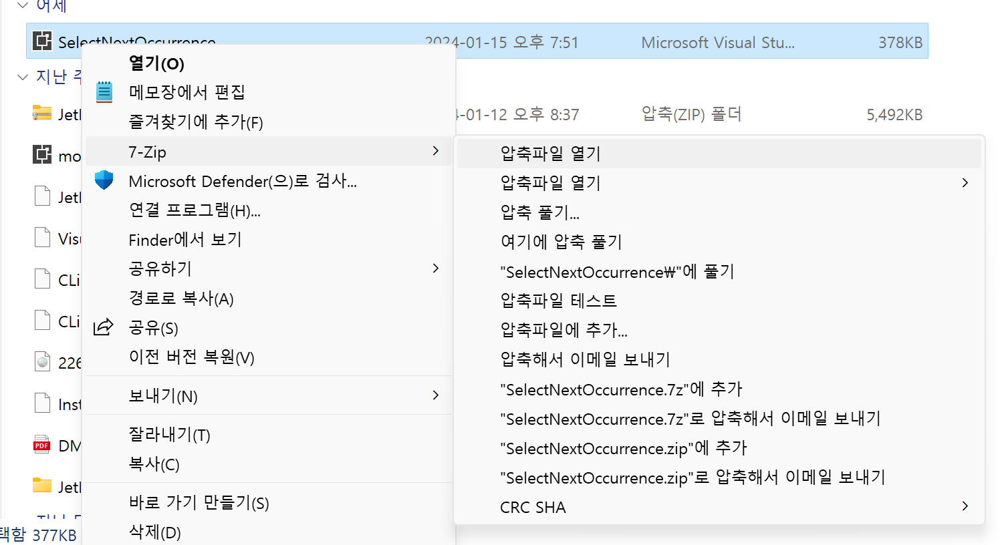
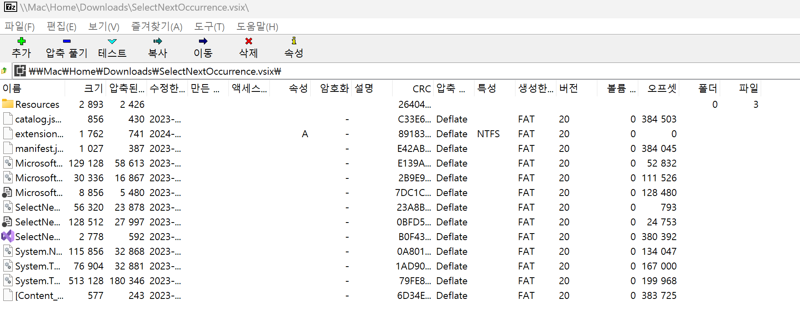
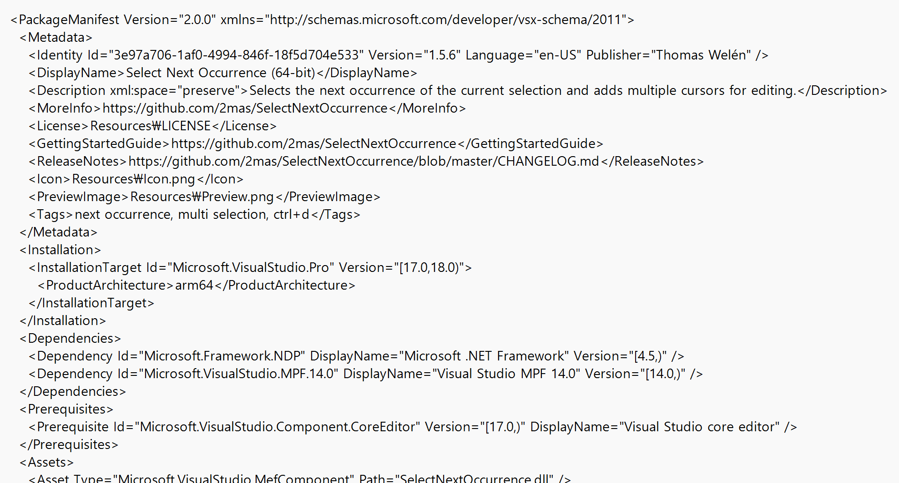

## 💻 Mac Parallels
맥북에서 parallels를 이용해, Window를 설치했다.

Window 환경에서 개발을 진행하기 위해서 설치했고, 가상머신 위에서 얼마나 쾌적할지 걱정했지만 사용성이 괜찮았다.  
물론 아직 규모 있는 프로젝트를 진행하진 않아서 문제가 없었지만, 성능이 더 요구되면 어려울 수도 있다.

문제는 Parallels 위에서 Visual Studio 2022를 사용할 때 발생했다.  
VS도 Extension이 있는데, 대부분의 extension을 설치할 수 없었다.  
여러 시도를 한 끝에 이런 환경에서 설치하는 방법을 남겨 놓는다!

## VSIX 파일 수정
[vs marketplace](https://marketplace.visualstudio.com/vs)에 들어가보면 다양한 extension을 볼 수 있다.  
vsix 파일을 설치해서 실행하면, 설치 할 수 있는 버전을 찾을 수 없다고 나온다.  
이상하게 IDE 내에서 검색되는 extension과 웹에 있는게 달랐는데, 결과적으로 각 extension마다 지원하는 버전과 프로세서가 다르기 때문이다.  

Mac M1은 arm64 칩을 사용한다. 컴퓨터 하드웨어를 잘 모르지만, Window 생태계에서는 대부분 intel 혹은 Arm 칩을 사용하는 것으로 안다.
때문에 대부분의 Extension들이 Arm64를 지원하지 않았다. (**amd64와 헷갈렸다...**)

그래서 [VS extension top 10](https://www.bytehide.com/blog/visual-studio-2022-extensions)의 대부분을 사용할 수 없다.

marketplace에서 extension을 설치하면 .vsix 확장자의 파일이 설치된다.  
7-zip (혹은 다른 zip 관련 프로그램)을 설치 후!  
해당 파일에 대해 아래와 같이 진행한다.  

압축을 열고~

extension manifest 파일을 편집한다.

여기서 보면 IDE(vs)의 Target Version과 Architecture 등이 있다.  
여기서 버전이 맞지 않다면 버전을, Arm64 환경에서 동작해야 한다면 Architecture를 변경해주면 vsix 파일이 잘 작동한다.  

물론 extension의 설정을 변경해서, 오작동하는 경우도 있을테지만 theme와 같은 extension들은 크게 충돌하지 않는 것 같다!

때문에 Mac Parallels에서도 extension을 설치할 수 있었다!

